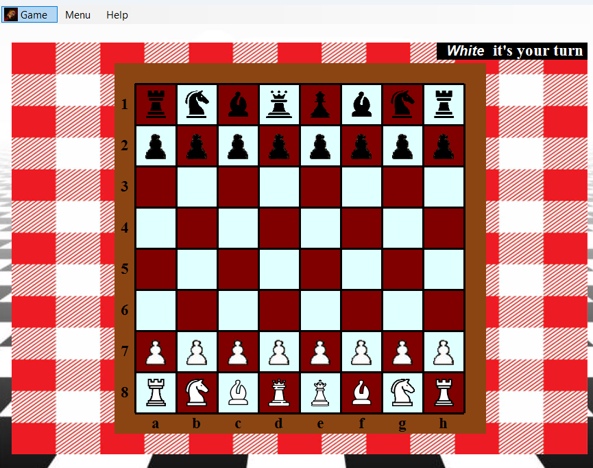

# Chess Game - C# .NET
A desktop chess application built with C# and .NET WinForms, focusing on clean OOP architecture.

## Features
- **Full Piece Logic:** Custom validation for all chess pieces (King, Queen, Bishop, Knight, Rook, Pawn).
- **Movement Highlighting:** Visual indicators for valid moves and potential captures.
- **Sound Effects:** Immersive audio feedback for moves and captures.
- **OOP Architecture:** Extensive use of inheritance (Base `Piesa` class) and polymorphism.

## Technologies Used
- C# / .NET
